# 微信读书 EPUB 排版支持度实测 / WeRead EPUB Style Support

> **English (summary)**
> This repo documents, with **real-device testing**, which EPUB/CSS features actually work when a self-made EPUB is imported into **WeChat Reading (微信读书)** — a self-developed (non-WebView) rendering engine that silently rewrites or drops a lot of standard CSS.
> It contains: a **machine-readable rule file** (`docs/style-support.json`) for AI/agents, a **human-readable report** with allowed / dead / gray-zone lists, a **reproducible specimen EPUB** (17 chapters / 78 probes) you can import and verify yourself, build & validation scripts, and screenshot evidence.
> Use it to make your EPUB pipeline WeChat-Reading-proof, or to let an AI generate compliant CSS. Docs & specimen: CC BY 4.0 · Scripts: MIT.

---

## 这是什么

一本自造的**排版样张 EPUB**（17 章、78 个探针，每个探针都有 `T01.1` 这样的编号）+ 一份**真机逐屏实测结论**。

把样张书导入微信读书后逐屏截图判读，把「哪些排版手段在微信读书里还活着」从猜测变成可观测的事实。结论服务于三类人：

- **作者 / 排版流水线**：做自制 EPUB 时知道哪些 CSS 能写、哪些白写、哪些会坏事
- **AI / 生成器**：直接消费 `docs/style-support.json`，生成合规 CSS
- **复核者**：拿样张书自己导入测一遍，验证或挑战结论

## 三条全局结论

1. **外部 `style.css` 会被解析，但只稳定认「扁平单类名」**。后代选择器、伪类/伪元素、`@media` 都不可靠，连内联 `style` 属性都会被拆掉。
2. **`text-indent` 与 `line-height` 被 App 全局设置接管**（正文首行缩进 / 行距），CSS 里写了也无效；连 `text-indent:0` 都会被缩进。
3. **结构型元素基本可用**（标题阶梯、列表、表格、代码块、引用块、图片等比缩放、上下标、链接、emoji）；死区集中在三处：**硬分页**（只能拆 spine 文件）、**EPUB3 弹注**、**章内锚点跳转**（点角标无反应）。

## 结论速览

完整版见 [docs/weread-epub-style-support.md](docs/weread-epub-style-support.md)，机器可读版见 [docs/style-support.json](docs/style-support.json)。

| CSS 特性 | 状态 | 说明 / 替代方案 |
| --- | --- | --- |
| 扁平单类名的 `color` / `background` / `text-align` / `letter-spacing` / `border` | ✅ 活 | 稳定生效 |
| `h1`–`h4` 标题阶梯、列表全家、表格全家、`pre`/`code`、`blockquote`、`sup`/`sub`、`hr`、emoji | ✅ 活 | 结构型元素基本全活 |
| 图片（不带尺寸样式） | ✅ 活 | 按版心宽等比缩放、不裁切 |
| `text-indent` | ❌ 死 | 被 App 全局缩进接管，写了也白写 |
| `line-height` | ❌ 死 | 被 App 全局行距接管 |
| `px` 字号 | ❌ 死 | 被压回正文大小，用 `em/rem/%/pt` |
| 内联 `style` 属性 | ❌ 死 | 会被拆掉，别指望兜底 |
| `page-break-*` / `break-inside` | ❌ 死 | 硬分页只能拆 spine 文件 |
| EPUB3 弹注 / 章内锚点跳转 | ❌ 死 | 注释平铺、角标点击无反应 |
| `flex` / `transform` / `text-shadow` / `small-caps` | ❌ 死 | 进黑名单 |
| 后代 / 伪类 / `@media` 选择器 | 🟡 灰 | 一律回退扁平单类名 |
| `font-family` | 🟡 灰 | 白名单式：单一字体名无效，特定字体栈整串可生效（见文档 §4） |
| 图片定宽 / `figure` 居中 / `float` 绕排 | 🟡 灰 | 出图时定死尺寸、居中画进图片、上下排列 |

## 快速开始：用样张书自测

1. 把 `epub/weread-epub-style-specimen-1.0.epub` 导入微信读书：
   App → 底部「书架」→ 右上角「+」→「从本地导入」（网页版 weread.qq.com「导入书籍」拖拽上传也可以）
2. 每个探针都有 `T01.1` 这样的编号，可直接用 App 内搜索定位
3. **灰底 `SENTINEL` 段是哨兵**：正常永远是灰的；被染成相邻探针的颜色 → 说明后台「样式分离」把样式区间切错了
4. 每章末尾的粉色「章末哨兵」用来看样式会不会串到下一章
5. 对照 `docs/weread-epub-style-support.md` 里每条探针的「预期结果」判断

## 给 AI 用

- **`docs/style-support.json`**：24 条结构化规则（`allowed / gray / dead` 三态 + 原因 + 替代方案 + 证据强度）+ 楷体字体栈 + 出书前自检清单
- **`AGENTS.md`**：AI agent 的操作指令（怎么读规则、怎么生成合规 CSS、怎么自检）
- **`llms.txt`**：标准指针文件

## 证据截图

真机截图（微信读书 Mac App，ARM 架构与 iOS 同引擎）：

| 主题 | 截图 |
| --- | --- |
| P01 首行缩进被全局接管 | 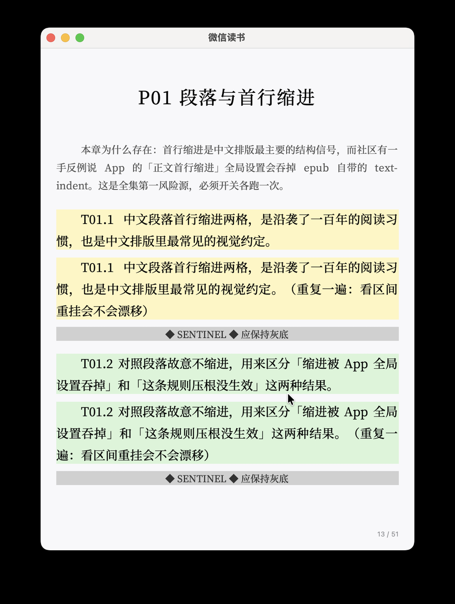 |
| P03 标题阶梯 | 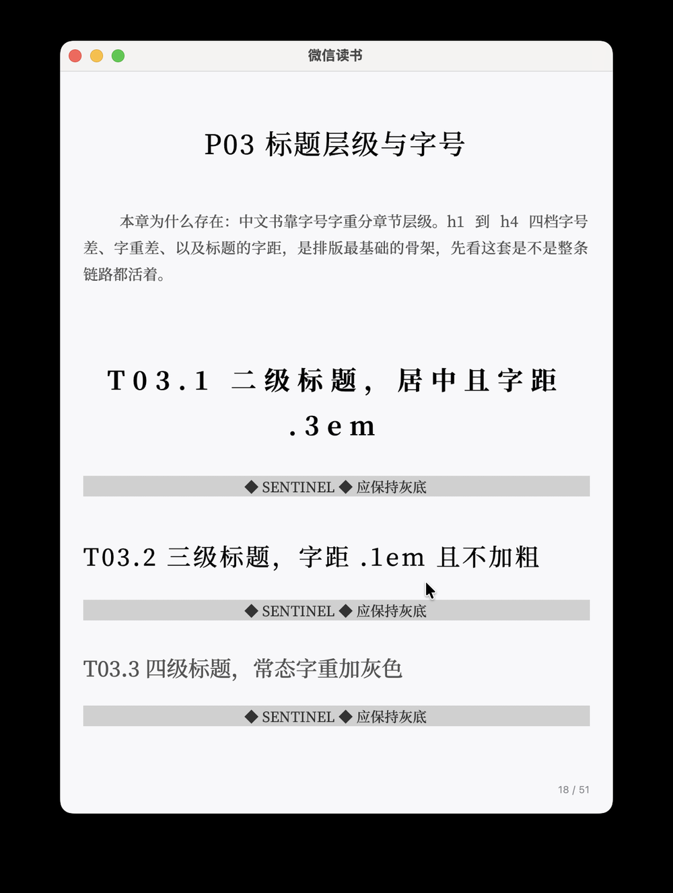 |
| P04 列表 | 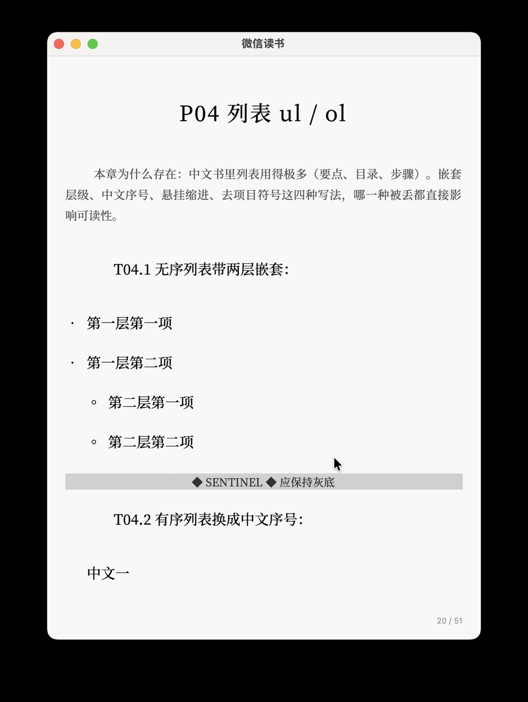 |
| P05 引用块 | 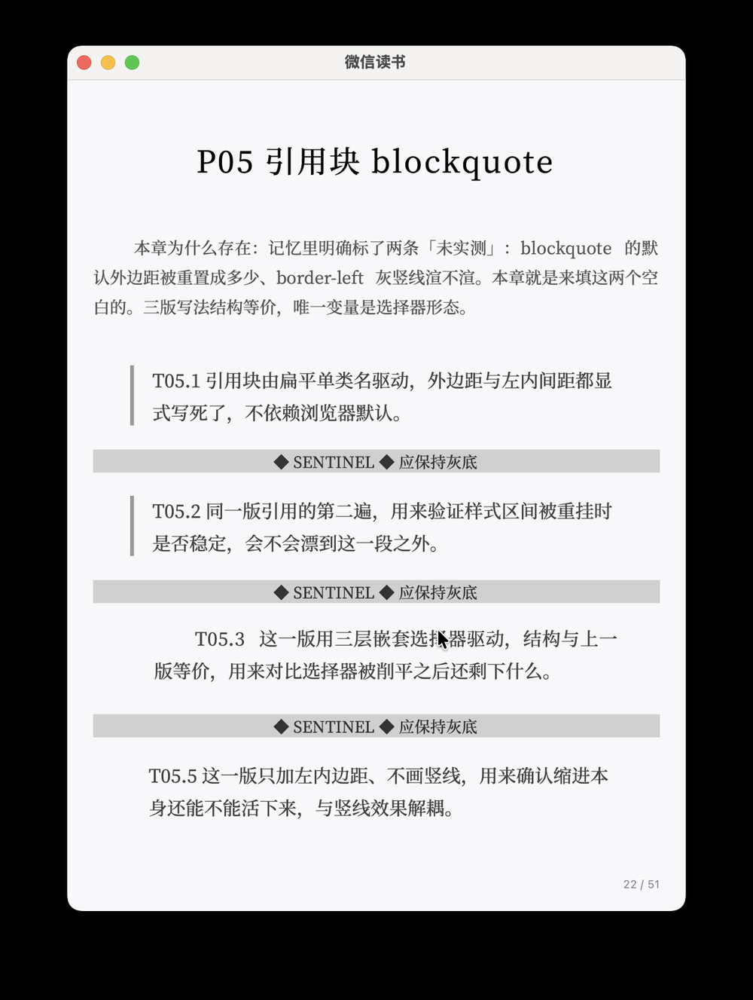 |
| P06 图片等比缩放 | 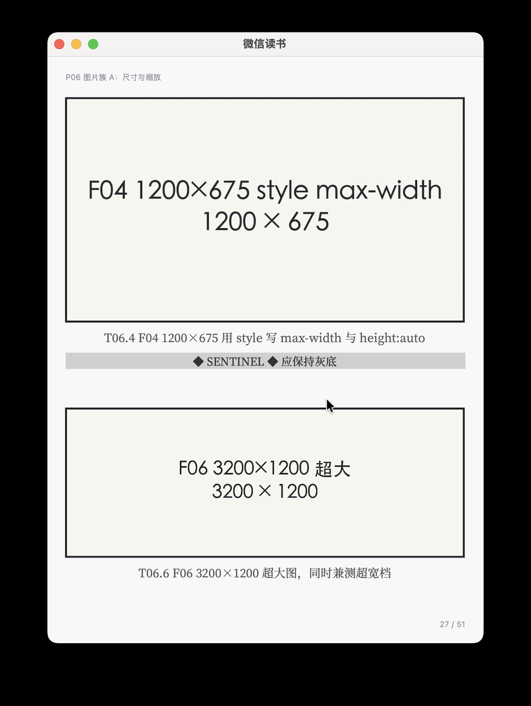 |
| P08 图文混排（float 的图不渲染） | 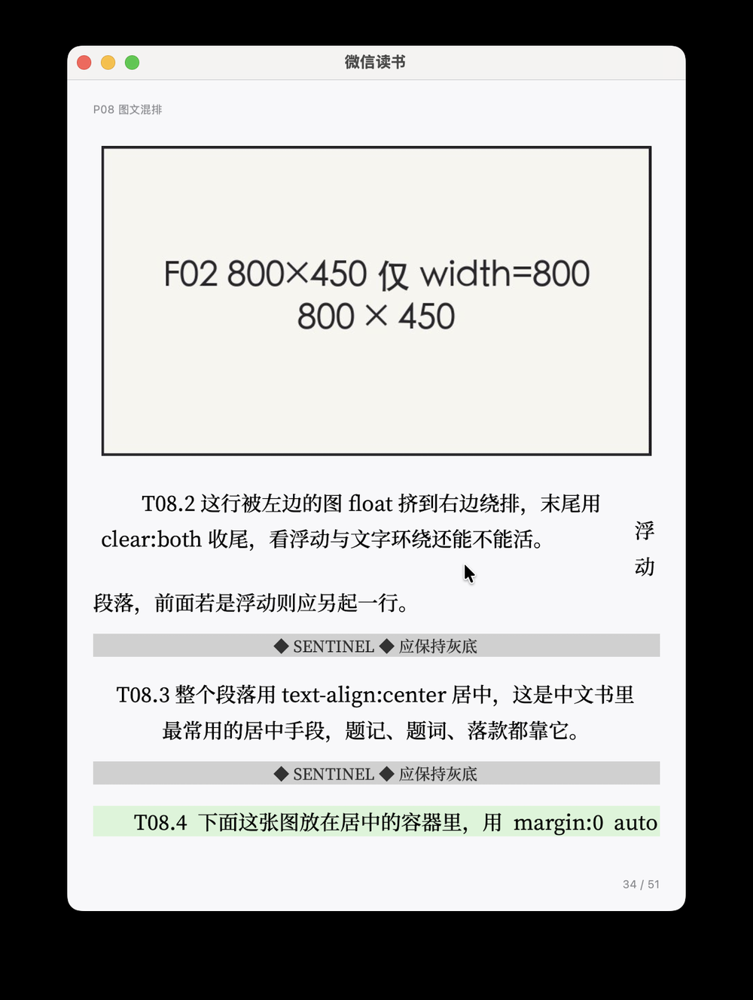 |
| P09 表格原生可用 | 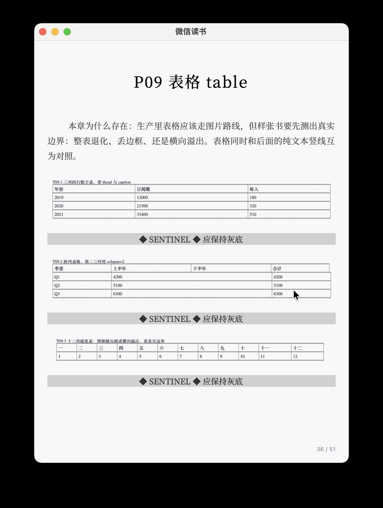 |
| P12 选择器能力台 | 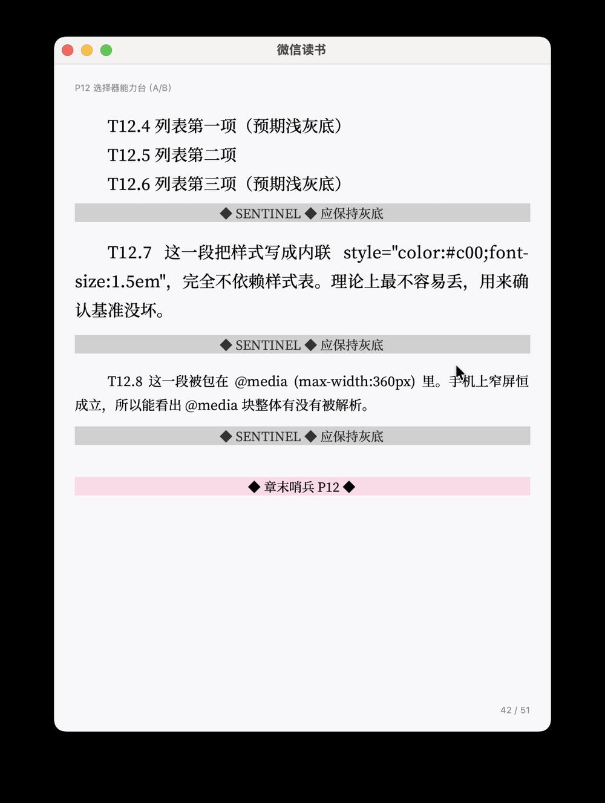 |
| P13 分页失效 | 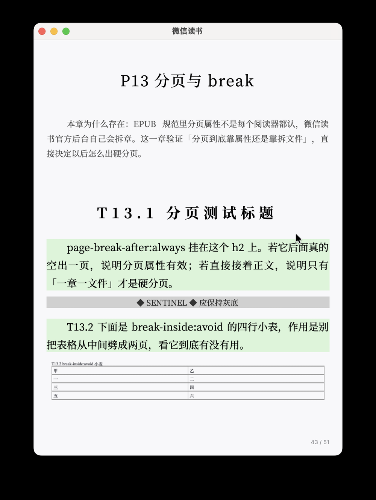 |
| P14 注释与脚注 | 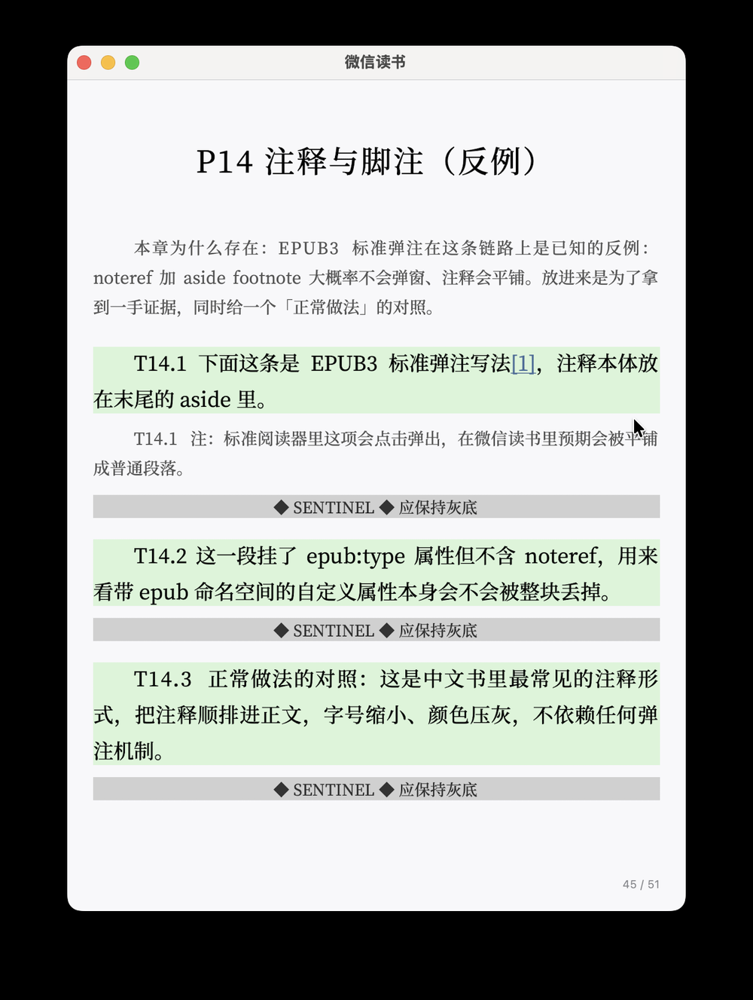 |
| P16 危险元素 | 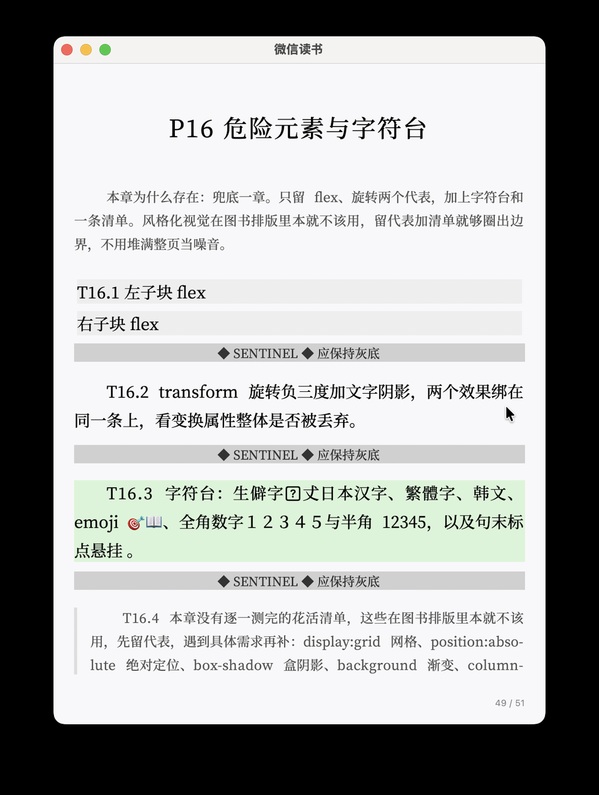 |
| N01 无样式基准页 | 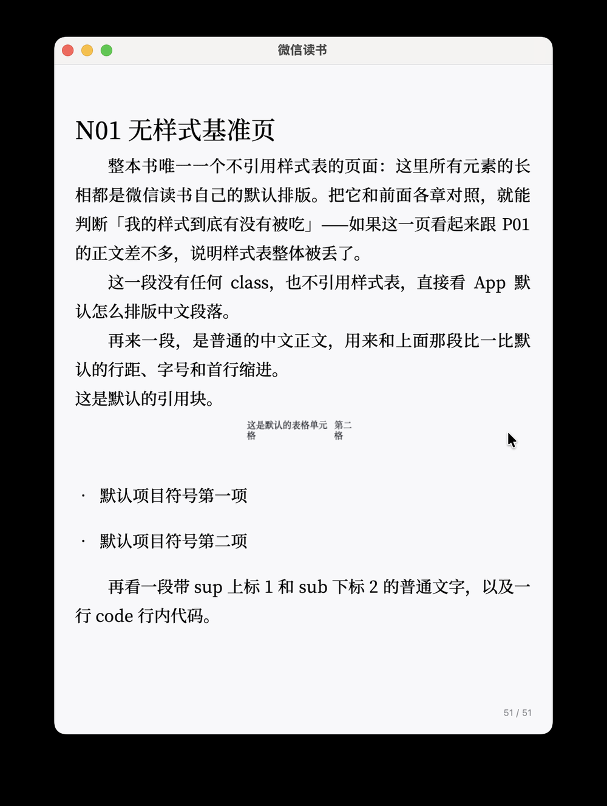 |

其余见 `evidence/screenshots/` 目录。

## 复现

```bash
pip install -r build/requirements.txt      # 仅需 Pillow（封面绘图）
cd build
python3 spec_build.py --version 1.0        # 生成 ../epub/weread-epub-style-specimen-1.0.epub
python3 spec_validate.py --epub ../epub/weread-epub-style-specimen-1.0.epub
```

样张书内容完全由 `build/spec.json` 描述（书名、章节、探针、内置测试图），改 JSON 即可定制自己的样张。

## 仓库结构

```
├── README.md                     本文件
├── AGENTS.md                     给 AI agent 的操作指令
├── llms.txt                      LLM 指针文件
├── docs/
│   ├── weread-epub-style-support.md   人类可读实测结论（真源）
│   └── style-support.json             机器可读规则（活/死/灰 + 替代方案）
├── epub/
│   └── weread-epub-style-specimen-1.0.epub   样张书（17 章 / 78 探针）
├── build/                        样张书构建与校验脚本
└── evidence/screenshots/         真机截图证据
```

## 许可

- 文档、样张书、截图：[CC BY 4.0](LICENSE)
- 构建脚本：[MIT](LICENSE-MIT)

## 免责声明

- 结论来自**特定版本**微信读书 App 的真机实测，App 更新后行为可能变化；本仓库**不是官方文档**，与官方说法冲突时以官方为准。
- 欢迎用仓库内的样张书复现任何一条结论；发现不符请开 issue，并附上探针编号（如 `T01.1`）。
